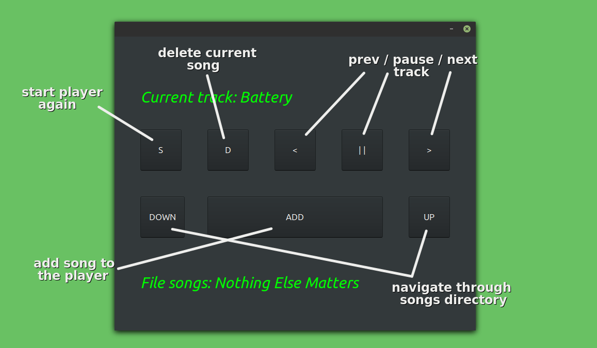

# MP3-Media-Player
## Practical application to doubly-linked lists

<br/>

### Install the required libraries:

* UPDATE
```
apt-get update
```

* GUI:
```
apt-get install libgtk-3-dev
```

* THREAD:
```
apt-get install libpthread-stubs0-dev
```

* AUDIO:
```
apt-get install libmpg123-0
apt-get install libao-dev
apt-get install curl
```

### Build:
```
make
```

### Cleanup:
```
make clean
```

### Usage:
&nbsp;&nbsp;&nbsp;&nbsp;&nbsp;&nbsp; First, add MP3 songs with ID3v1 metadata format. 
Then run ```make run``` and the below window will appear:

<p align="left">
  
</p>
